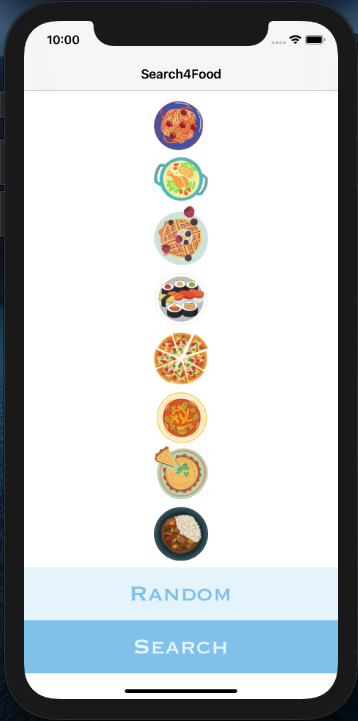
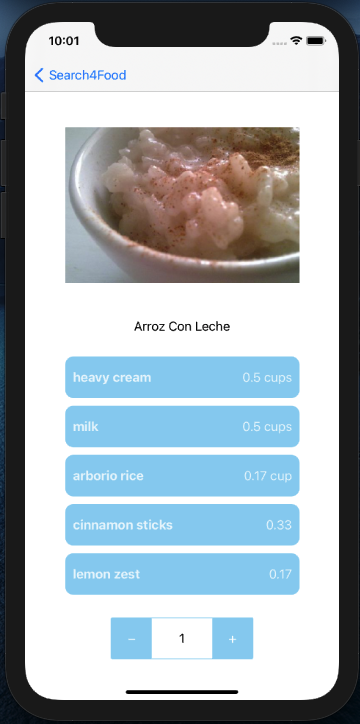
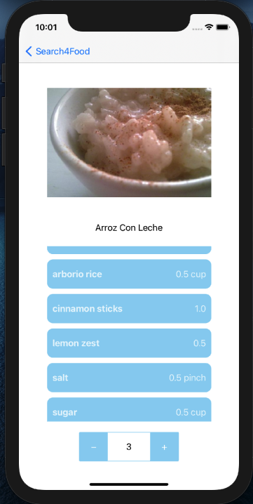
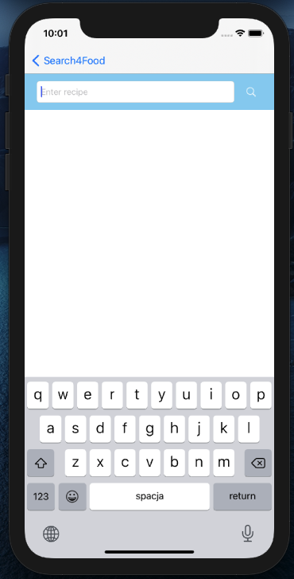
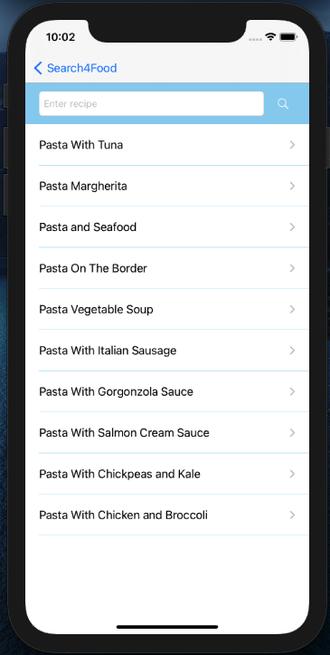

Hi! Project is still in progress! :sunglasses:

This app is being developed for people who don't have any idea for meal and let the app random one for them. 
Also is possible to search some kind of meals, like pasta, pizza, etc. 

The app is written in MVC design pattern. I used storyboard to design my views. 
The data for recipes are uploaded from "Spoonacular API".
I also used MKStepper (https://github.com/kamrul-cse/MKStepper) using Podfile and SDWebImage(https://github.com/SDWebImage/SDWebImage) to get the image from string using Swift Package Dependencies. 

Below app views: 

* Menu view

* View after "Random" button pressed: 

* View after "Search" button pressed:

* View after "pasta" searching:

